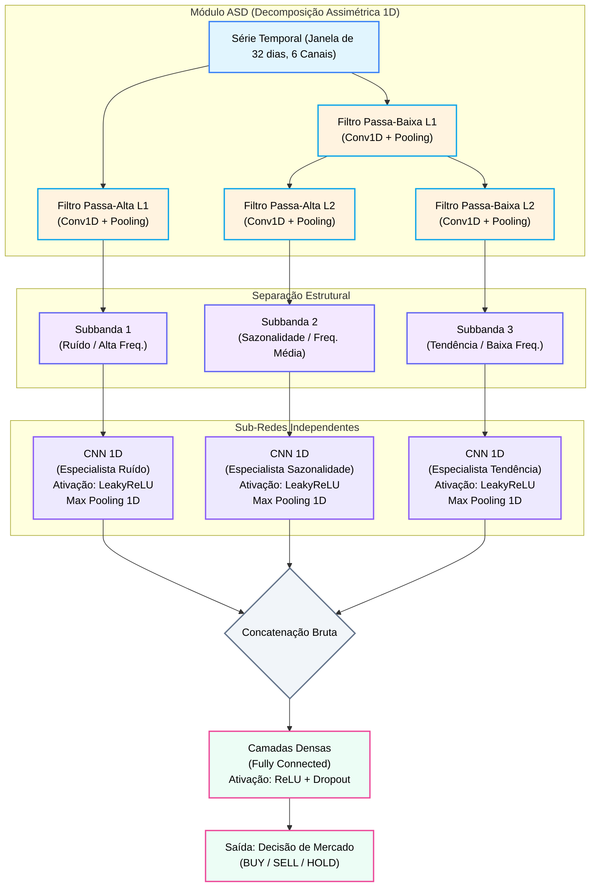

# MSR-CNN Finance: Adaptive Subband Decomposition para Séries Temporais 📈

Este repositório contém a implementação do projeto de mestrado que adapta a arquitetura **MSR-CNN** (Multi-Channel Subband Regularized Convolutional Neural Network) – originalmente proposta para processamento de imagens (Sinha et al., 2023) – para o domínio financeiro usando **séries temporais 1D**.

## 🧠 Sobre o Projeto

As séries financeiras são classicamente decompostas em três componentes: **Tendência** (Longo prazo), **Sazonalidade/Ciclos** (Médio prazo) e **Ruído** (Curto prazo). A maioria das redes neurais (CNNs) tradicionais processa esses sinais como um todo (full-band), o que dificulta o aprendizado e aumenta a sensibilidade ao ruído.

Neste projeto, utilizamos uma **Decomposição Adaptativa em Subbandas Assimétrica (ASD)**. O modelo aprende ativamente, de ponta a ponta (end-to-end), a separar o sinal de entrada nessas 3 frequências utilizando uma árvore de filtros `Conv1D`. Cada frequência é então processada por uma CNN independente.

### Arquiteturas Implementadas
1. **Baseline CNN 1D:** Rede tradicional para fins de controle e comparação de performance.
2. **MSR-CNN 1D (Clássico):** Rede que separa o sinal nas 3 subbandas, extrai as features isoladamente e as concatena para a classificação direcional do mercado (BUY, SELL, HOLD).
3. **MSR-CNN 1D (Atenção):** Extensão inédita do artigo base. Implementa um mecanismo de atenção visual (Softmax) entre as subbandas, permitindo que a rede dê pesos dinâmicos ao Ruído, Sazonalidade ou Tendência a depender do regime momentâneo do mercado.

## 📊 Dados Utilizados

O projeto utiliza a biblioteca `yfinance` para baixar dados diários da bolsa brasileira (Ibovespa):
- **Tickers:** `^BVSP`, `PETR4.SA`, `VALE3.SA`, `ITUB4.SA`.
- **Features extraídas e suas finalidades:**
  - **Retornos Logarítmicos:** Estabilizam a variância dos retornos e lidam melhor com juros compostos em comparação com o retorno percentual simples. Atuam como o principal indicador da direcionalidade diária.
  - **Volume:** Mede a força institucional por trás de um movimento de preço. Uma tendência ou rompimento acompanhado de alto volume tem maior probabilidade de continuidade.
  - **RSI (Relative Strength Index):** Oscilador de *momentum* que indica condições de sobrecompra (acima de 70) ou sobrevenda (abaixo de 30). Ajuda o modelo a identificar possíveis pontos de reversão por exaustão do mercado.
  - **MACD (Moving Average Convergence Divergence) e MACD Signal:** Capturam a relação entre diferentes médias móveis exponenciais. São cruciais para a rede detectar acelerações de tendência (*momentum*) e cruzamentos que indicam mudanças de ciclo de médio prazo.
  - **ATR (Average True Range):** Medidor puro de volatilidade direcional. Ensina à rede o "tamanho" esperado do risco atual, permitindo que ela contextualize se um movimento forte é um rompimento real ou apenas o ruído natural para o nível de volatilidade do momento.
- **Target (Label):** Retorno futuro em janela de 5 dias classificado como BUY (+1.5%), SELL (-1.5%) ou HOLD.

### Por que uma Decomposição Assimétrica?
A arquitetura MSR-CNN original utilizava uma árvore simétrica (dividindo os sinais em potências de 2, 4, 8...). Neste projeto de mestrado, optamos por uma **Decomposição Assimétrica** por três justificativas técnicas:
1. **Alinhamento com a Teoria Econômica (STL):** A análise estatística financeira foca em exatamente 3 componentes: Tendência, Sazonalidade e Ruído. A árvore assimétrica nos permite forçar a rede a gerar exatamente 3 canais de informação (Subbandas), mantendo o modelo interpretável.
2. **Foco na Frequência Correta:** O modelo descarta o Ruído na primeira etapa e aplica processamento profundo apenas nas baixas frequências e frequências médias, onde o "sinal real" da economia reside.
3. **Prevenção de Overfitting:** Evita o custo computacional inútil de fatiar o ruído repetidas vezes.

### Justificativa de Hiperparâmetros
- **Lookback Window (Janela de 32 dias):** O mercado financeiro sofre de quebra de regime e não-estacionariedade. Uma janela de 32 pregões (~1,5 meses) atua como o *sweet spot* ideal para prever o curto prazo. Janelas maiores (ex: 120 dias) "poluiriam" a rede com memórias de contextos econômicos antigos, tornando o modelo lento para reagir a crises ou novas tendências.
- **Forecast Target (Alvo de 5 dias):** Representa exatamente uma semana completa de negociações. Alvos menores (1 dia) são esmagados pela aleatoriedade estocástica diária, enquanto alvos maiores (30 dias) exigem dados fundamentalistas e macroeconômicos que fogem do escopo dos sinais técnicos capturados pelas convoluções.

### Fluxo da Arquitetura

Abaixo detalhamos visualmente as duas versões da rede implementadas neste projeto.

#### 1. MSR-CNN Clássico (Original Adaptado)
Nesta versão, que replica a lógica do artigo original adaptada para séries temporais, as subbandas são concatenadas de forma bruta e enviadas diretamente para o classificador final (Camada Densa). A rede precisa descobrir sozinha na "força bruta" qual frequência importa mais.



**Entendendo o Fluxo Clássico (Passo a Passo):**
1. **A Entrada:** A rede recebe uma matriz contendo os dados dos últimos 32 pregões divididos em 6 canais (Retorno Logarítmico, Volume e indicadores técnicos).
2. **A Separação (Módulo ASD):** A matriz passa por filtros de convolução 1D agrupados (*depthwise*). A rede "fatia" a matriz separando as oscilações caóticas diárias (Ruído), os movimentos cíclicos (Sazonalidade) e o direcional de longo prazo (Tendência).
3. **Sub-Redes Especializadas:** Cada um desses 3 sinais é enviado para uma pequena rede convolucional totalmente isolada das demais. Cada especialista procura padrões estruturais focando apenas na sua faixa de frequência, utilizando funções de ativação **LeakyReLU** (para preservar gradientes negativos sutis financeiros) seguidas de *Max Pooling*.
4. **Concatenação e Decisão Final:** As extrações dos três especialistas são unidas lado a lado (Concatenação Bruta) e entregues à Camada Densa final. A rede final (utilizando a ativação não-linear **ReLU** e **Dropout** para regularização) tenta deduzir a classe (`BUY/SELL/HOLD`) forçando sentido nessa mistura homogênea.

---
## 📂 Estrutura do Repositório

```text
├── src/                        # Códigos-fonte Python
│   ├── data_pipeline.py        # Coleta e pré-processamento de dados
│   ├── models.py               # Arquiteturas PyTorch (MSR-CNN, Baseline)
│   ├── train.py                # Script de treinamento dos modelos base
│   ├── evaluate.py             # Validação preditiva e extração de FFT
├── docs/                       # Documentação e relatórios do projeto
│   └── analise_resultados.md   # Relatório detalhado dos resultados
├── data/                       # Arquivos CSV gerados (Treino/Validação/Teste)
├── checkpoints/                # Pesos (.pt) dos modelos treinados
├── results/                    # Gráficos analíticos salvos (FFT, Matrizes)
└── README.md                   # Este arquivo
```

---

## 🚀 Como Replicar na sua Máquina

O código foi otimizado nativamente para uso de aceleração no **macOS (Apple Silicon - MPS)**, mas pode rodar em CUDA ou CPU facilmente (há fallback automático implementado nos scripts).

### 1. Clonar e Instalar Dependências

Crie um ambiente virtual usando o Python (versão 3.9+ recomendada):

```bash
# Clone o repositório
git clone https://github.com/jpmsilva1/Projeto_redes_Neurais_MSR_CNN.git
cd Projeto_redes_Neurais_MSR_CNN

# Crie e ative o ambiente virtual
python3 -m venv venv
source venv/bin/activate  # No Windows use: venv\\Scripts\\activate

# Instale os pacotes necessários
pip install torch torchvision torchaudio yfinance pandas ta scikit-learn matplotlib seaborn
```

### 2. Rodar o Pipeline de Dados

Este script fará o download da base e criará os arquivos CSV normalizados divididos em Treino, Validação e Teste na pasta `data/`.

```bash
python src/data_pipeline.py
```

### 3. Treinar os Modelos

Para treinar a Baseline e o MSR-CNN clássico:

```bash
python src/train.py
```
*(Os pesos dos modelos treinados ficarão salvos na pasta `checkpoints/`).*

### 4. Avaliar e Analisar a Interpretabilidade

A grande vantagem estrutural desse modelo é poder entender **o que** ele aprendeu. O script de avaliação não só diz a acurácia, mas também extrai a Transformada Rápida de Fourier (FFT) dos pesos convolucionais para provar que a rede se organizou isolando as Baixas Frequências, Frequências Médias e Altas Frequências (filtros Passa-Baixa, Passa-Banda e Passa-Alta).

```bash
python src/evaluate.py
```
*(Os gráficos analíticos e espectrais serão salvos na pasta `results/`).*

### 5. Validação Temporal das Previsões

Para verificar a qualidade real das previsões, este script compara as classificações previstas (BUY/SELL/HOLD) dos 3 modelos com o retorno real observado no mercado nos 5 dias seguintes. Gera Matrizes de Confusão, gráficos temporais e uma tabela comparativa completa.

```bash
python src/validate_predictions.py
```
*(Os resultados serão salvos na pasta `results/validation/`).*

---

## 🔬 Resultados de Interpretabilidade

Os gráficos gerados na pasta `results/` confirmam a eficácia analítica da rede:
1. **Filtros Passa-Banda (FFT):** Ao rodar a avaliação, observe na pasta `results/interpretabilidade/` as transformadas de Fourier dos pesos aprendidos na primeira e segunda camadas do ASD. Você notará que, sem qualquer supervisão forçada, a rede *aprende de fato* a gerar um filtro passa-alta na primeira saída e passa-baixa na segunda.

---

## 📖 Referências
- *P. Sinha, I. Psaromiligkos and Z. Zilic, "A Structurally Regularized CNN Architecture via Adaptive Subband Decomposition," in IEEE Transactions on Neural Networks and Learning Systems, vol. 36, no. 7, pp. 12937-12951, July 2025, doi: 10.1109/TNNLS.2024.3486181.*
- *H. Wu et al., "A Multi-Scale Residual CNN for Time Series Classification," in Sensors, vol. 20, no. 12, p. 3395, 2020.*
