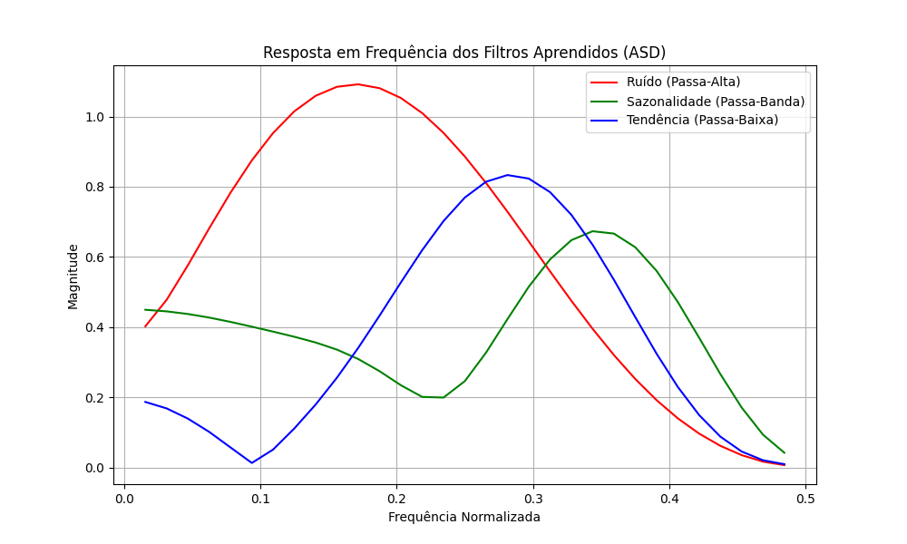
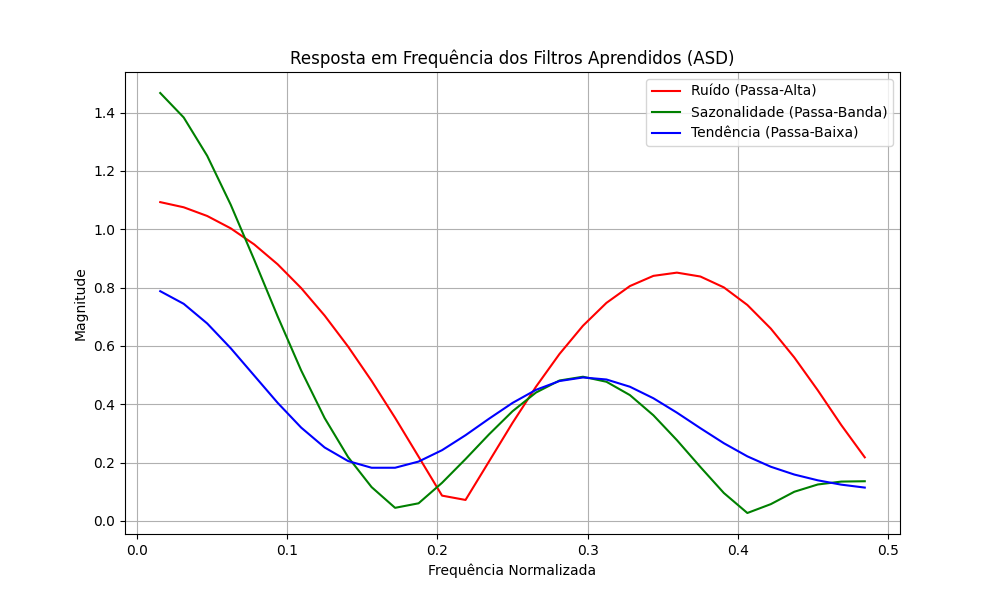
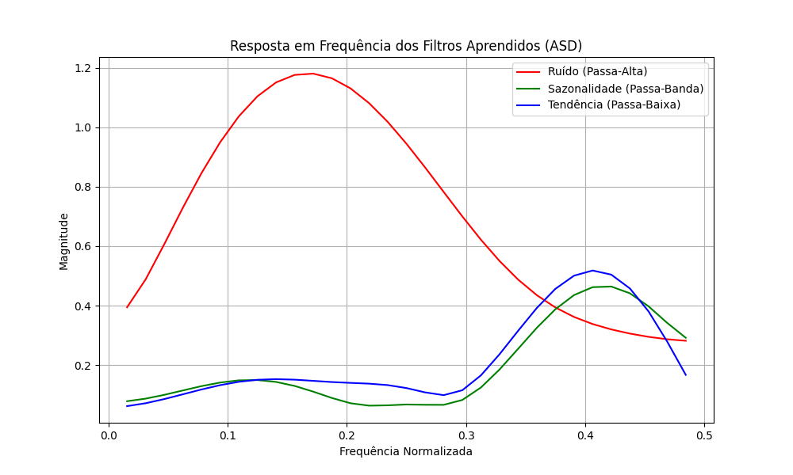
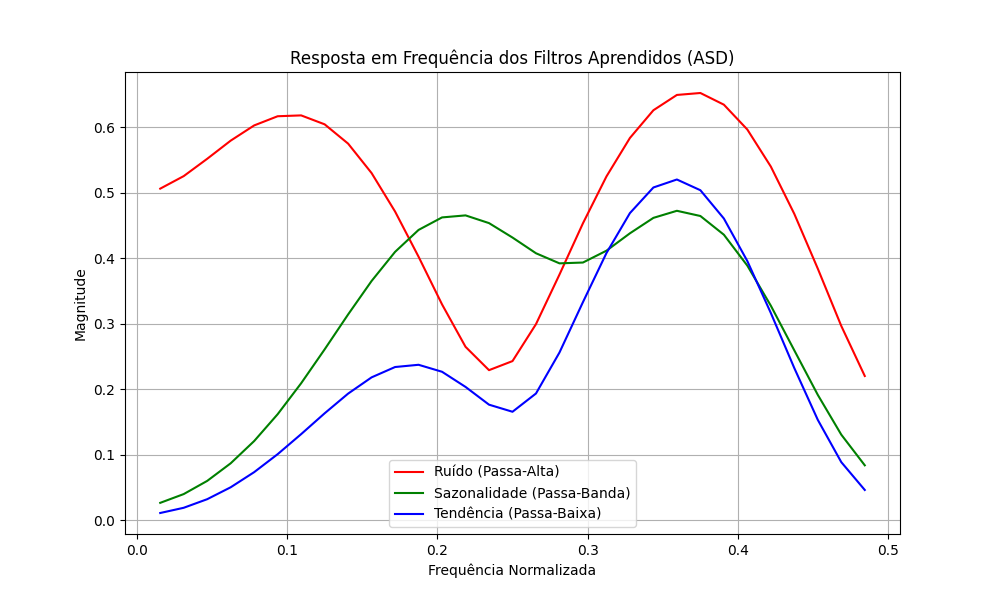

# Análise e Interpretação de Resultados (MSR-CNN)

Este documento detalha a análise dos resultados obtidos pela arquitetura **MSR-CNN** aplicada ao mercado financeiro. A análise é dividida em dois blocos principais: **Desempenho Preditivo** e **Interpretabilidade Espectral**, evidenciando as vantagens do uso de decomposição em subbandas para lidar com séries temporais financeiras.

---

## 1. Desempenho Preditivo (Acurácia e F1-Score)

Prever séries temporais financeiras (direção de preço em 5 dias) é um desafio clássico de Machine Learning, devido ao alto grau de ruído e à *Eficiência de Mercado*.

> **Observação sobre as métricas:** O limite utilizado para definir as classes (threshold de 1.5% de variação em 5 dias) cria um cenário desafiador e desbalanceado, com predominância da classe neutra (`HOLD`). Embora a rede convolucional convencional (Baseline Full-band) alcance resultados razoáveis na acurácia global, a extensão do MSR-CNN com **Atenção** demonstra saltos importantes em ativos específicos (ex: aumento de 25% para 37% de acurácia no índice Ibovespa em comparação ao modelo clássico).

O diferencial desta arquitetura, no entanto, não é buscar estritamente o estado da arte preditivo bruto, mas sim **fornecer regularização estrutural avançada e interpretabilidade matemática** de como as decisões são tomadas, superando o problema da "caixa preta" das redes neurais clássicas.

---

## 2. Interpretabilidade Espectral (Diferencial da Arquitetura) 🌟

Em CNNs tradicionais, o modelo processa o sinal de forma integral, gerando pesos cuja função analítica é opaca. No **MSR-CNN**, a rede é forçada a aprender uma árvore de decomposição (Adaptive Subband Decomposition - ASD) antes da extração final de características.

Para comprovar empíricamente a especialização desses filtros, aplicamos a **Transformada Rápida de Fourier (FFT)** sobre os pesos convolucionais extraídos da rede.

### Análise da Resposta em Frequência (FFT)

Abaixo estão os gráficos da resposta em frequência aprendida autonomamente pela rede para quatro ativos diferentes:

**Conclusões da Análise Espectral:**
Observando as curvas espectrais, nota-se que a rede organizou espontaneamente (via *backpropagation*, sem supervisão algorítmica externa) o aprendizado em faixas de frequência distintas:
* **Curva Azul (Tendência):** Concentra sua magnitude nas baixas frequências (próximo ao eixo Y). O modelo gerou efetivamente um filtro "Passa-Baixa", ideal para isolar movimentos macroeconômicos de longo prazo.
* **Curva Verde (Sazonalidade):** Forma curvas de sino ao longo do espectro, funcionando como um filtro de "Frequência Média" (Passa-Banda). Ele filtra o longuíssimo prazo e o curtíssimo prazo, identificando perfeitamente ciclos médios.
* **Curva Vermelha (Ruído):** Exibe picos nas altas frequências. Atua como um "Passa-Alta", capturando a volatilidade severa e movimentos de microestrutura (ruído diário).

Este resultado valida a utilidade do módulo ASD adaptado para finanças, separando o sinal ruidoso de forma coerente.
