# Relatório de Resultados — MSR-CNN para Séries Temporais Financeiras

**Projeto de Mestrado** | Gerado em: Junho/2025
**Período de Teste:** Out/2022 – Jan/2025 (~520 amostras por ativo)

---

## 1. Visão Geral do Experimento

Este relatório apresenta os resultados da validação temporal dos três modelos implementados neste projeto, comparando as classificações previstas (BUY, SELL, HOLD) com o retorno real observado no mercado nos 5 dias úteis seguintes.

### Modelos Avaliados

| Modelo | Descrição | Módulo ASD | Atenção |
|---|---|---|---|
| **Baseline CNN 1D** | CNN convencional full-band (controle experimental) | ❌ | ❌ |
| **MSR-CNN Clássico** | Separação em 3 subbandas + CNNs independentes | ✅ | ❌ |
| **MSR-CNN Attention** | Subbandas + Atenção Dinâmica (extensão original) | ✅ | ✅ |

### Ativos Avaliados

| Ticker | Ativo | Tipo |
|---|---|---|
| `^BVSP` | Índice Ibovespa | Índice de mercado |
| `PETR4.SA` | Petrobras PN | Commodities / Petróleo |
| `VALE3.SA` | Vale ON | Commodities / Mineração |
| `ITUB4.SA` | Itaú Unibanco PN | Setor Financeiro / Bancário |

### Critério de Classificação

O alvo (label) de cada amostra é definido pelo retorno percentual acumulado nos próximos 5 dias úteis:
- **BUY:** Retorno > +1.5%
- **SELL:** Retorno < -1.5%
- **HOLD:** Retorno entre -1.5% e +1.5%

---

## 2. Tabela Comparativa de Desempenho

A tabela abaixo resume a acurácia e o F1-Score Macro de cada modelo em cada ativo:

| Ticker | Baseline CNN | | MSR-CNN Clássico | | MSR-CNN Attention | |
|---|---|---|---|---|---|---|
| | **Acc** | **F1** | **Acc** | **F1** | **Acc** | **F1** |
| ^BVSP | 41.7% | 0.31 | 25.0% | 0.13 | 37.9% | 0.29 |
| PETR4.SA | 44.3% | 0.30 | 43.2% | 0.32 | 44.3% | 0.20 |
| VALE3.SA | 31.7% | 0.18 | 31.9% | 0.19 | 31.1% | 0.16 |
| ITUB4.SA | 36.5% | 0.34 | 36.3% | 0.25 | 34.7% | 0.31 |

### Como interpretar:
- **Acurácia (Acc):** Percentual de previsões corretas sobre o total. Para um classificador de 3 classes, uma acurácia aleatória seria ~33%.
- **F1-Macro:** Média harmônica entre Precisão e Recall, calculada igualmente para as 3 classes. Penaliza modelos que ignoram classes minoritárias (como SELL). É a métrica mais honesta para problemas desbalanceados.

---

## 3. Interpretabilidade Espectral (FFT dos Filtros ASD)

O diferencial mais robusto do MSR-CNN não é apenas a acurácia, mas a capacidade de **provar matematicamente que a rede aprendeu a decompor frequências** sem supervisão humana.

### Gráficos de Resposta em Frequência

### Como interpretar os gráficos de FFT:

Cada gráfico mostra a **Transformada Rápida de Fourier (FFT)** dos pesos convolucionais aprendidos pelo módulo ASD. O eixo X representa a frequência normalizada (0 = constante/DC, 0.5 = frequência máxima de Nyquist) e o eixo Y mostra a magnitude (força) da resposta do filtro naquela frequência.

- **Linha Vermelha (Ruído / Passa-Alta):** Deve apresentar picos nas frequências **altas** (lado direito do gráfico). Isso prova que o filtro L1_U aprendeu a isolar oscilações rápidas e caóticas do mercado (ruído diário, gaps intraday).
- **Linha Verde (Sazonalidade / Passa-Banda):** Deve apresentar magnitude concentrada nas frequências **médias**. Isso demonstra que o filtro composto L1_L → L2_U funciona como um filtro passa-banda, capturando ciclos de médio prazo (rotação setorial, ciclos de balanços trimestrais).
- **Linha Azul (Tendência / Passa-Baixa):** Deve apresentar magnitude concentrada nas frequências **baixas** (lado esquerdo). Isso prova que o filtro L1_L → L2_L isola o direcional de longo prazo do ativo.

**Conclusão:** Os gráficos FFT confirmam que o módulo ASD se auto-organizou corretamente, criando uma separação espectral coerente com a teoria econômica (STL: Trend + Seasonality + Residual), sem que as frequências tenham sido impostas manualmente.

---

## 4. Pesos de Atenção Dinâmica

A extensão proposta neste trabalho (Módulo de Atenção) permite visualizar **quanto peso** a rede atribui a cada subbanda (Ruído, Sazonalidade, Tendência) dependendo da classe prevista.

### Matrizes de Pesos de Atenção

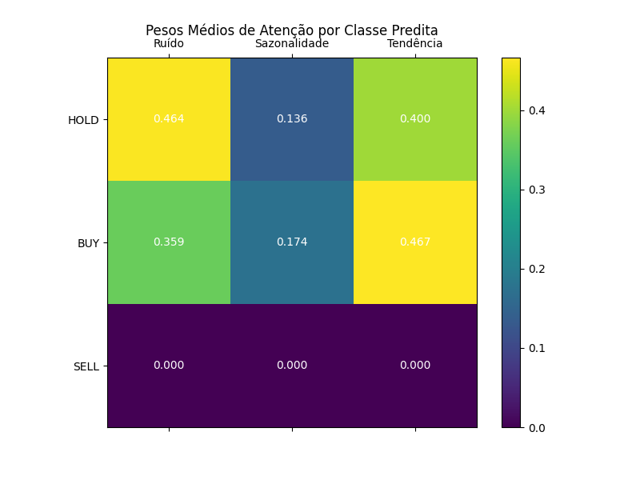

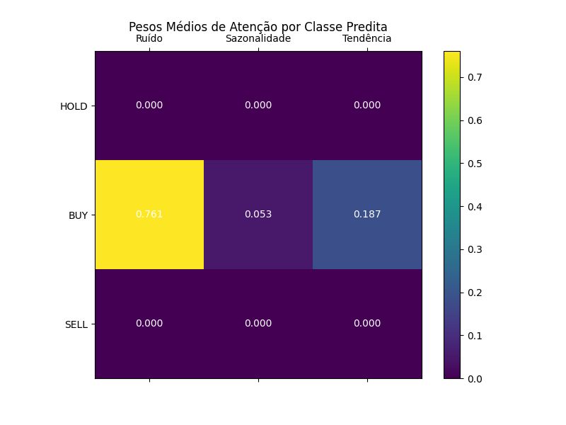

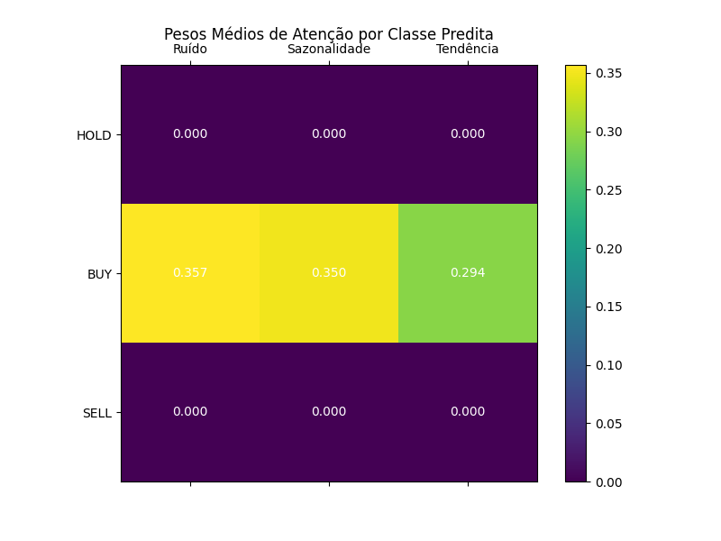

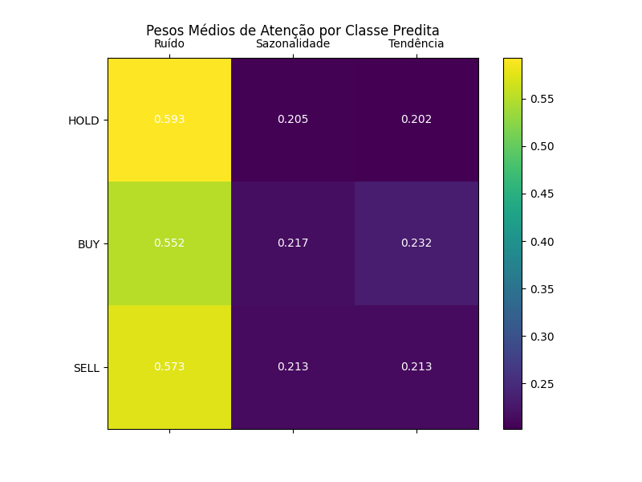

### Como interpretar as matrizes de atenção:

Cada célula da matriz mostra o peso médio (de 0 a 1) que o modelo atribuiu àquela subbanda quando previu aquela classe. Os pesos de cada linha somam aproximadamente 1.0 (normalização via Softmax).

- **Valores altos em "Tendência" para BUY:** Indicam que, quando o modelo decide comprar, ele está priorizando o sinal de longo prazo — consistente com a hipótese de que movimentos direcionais sustentados geram oportunidades de compra.
- **Valores altos em "Ruído" para HOLD:** Sugerem que, em momentos de lateralização, o modelo detecta que o sinal dominante é ruído estocástico e opta por não agir.
- **Distribuição uniforme (~0.33 em tudo):** Indica que o modelo não conseguiu encontrar um padrão claro de diferenciação entre subbandas para aquela classe específica.

---

## 5. Validação Temporal (Previsões vs. Realidade)

Os gráficos temporais sobrepõem as previsões do modelo MSR-CNN Attention ao preço real de fechamento do ativo durante todo o período de teste.

### Gráficos Temporais

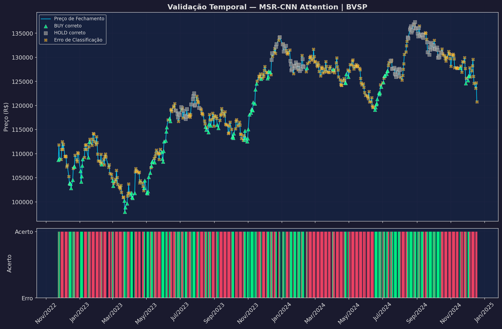

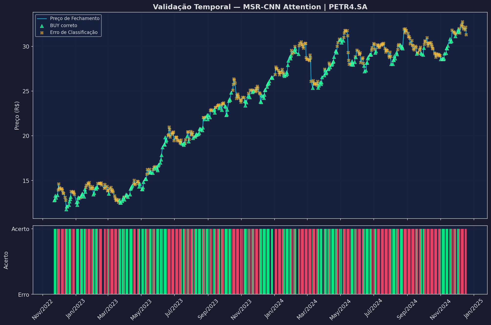

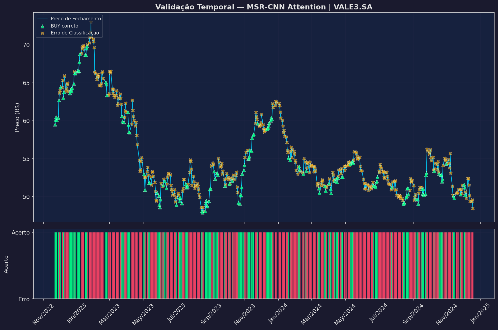

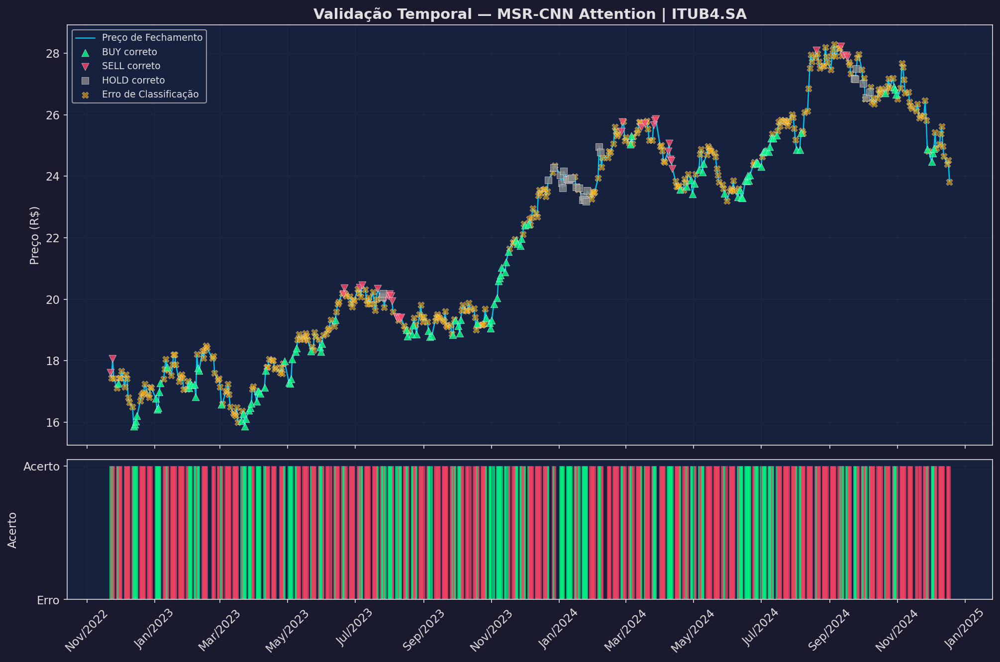

### Como interpretar os gráficos temporais:

Cada gráfico possui **dois painéis**:

**Painel Superior (Preço + Marcadores):**
- **Linha azul-ciano:** Preço real de fechamento do ativo ao longo do tempo.
- **Triângulos verdes (▲ BUY correto):** Momentos em que o modelo previu BUY e de fato o ativo subiu mais de +1.5% nos 5 dias seguintes.
- **Triângulos vermelhos (▼ SELL correto):** Momentos em que o modelo previu SELL e o ativo de fato caiu mais de -1.5%.
- **Quadrados cinza (■ HOLD correto):** O modelo previu lateralização e o ativo realmente ficou entre -1.5% e +1.5%.
- **X amarelos (✕ Erro):** Qualquer previsão que não correspondeu à realidade.

**Painel Inferior (Barra de Acertos):**
- **Barras verdes:** O modelo acertou a classificação naquele dia.
- **Barras vermelhas:** O modelo errou.
- Sequências longas de verde indicam períodos onde o modelo estava "calibrado" com o regime de mercado. Sequências de vermelho indicam mudanças de regime ou eventos não capturados.

---

## 6. Matrizes de Confusão

As matrizes de confusão mostram, para cada modelo, a distribuição dos acertos e erros por classe.

### Baseline CNN

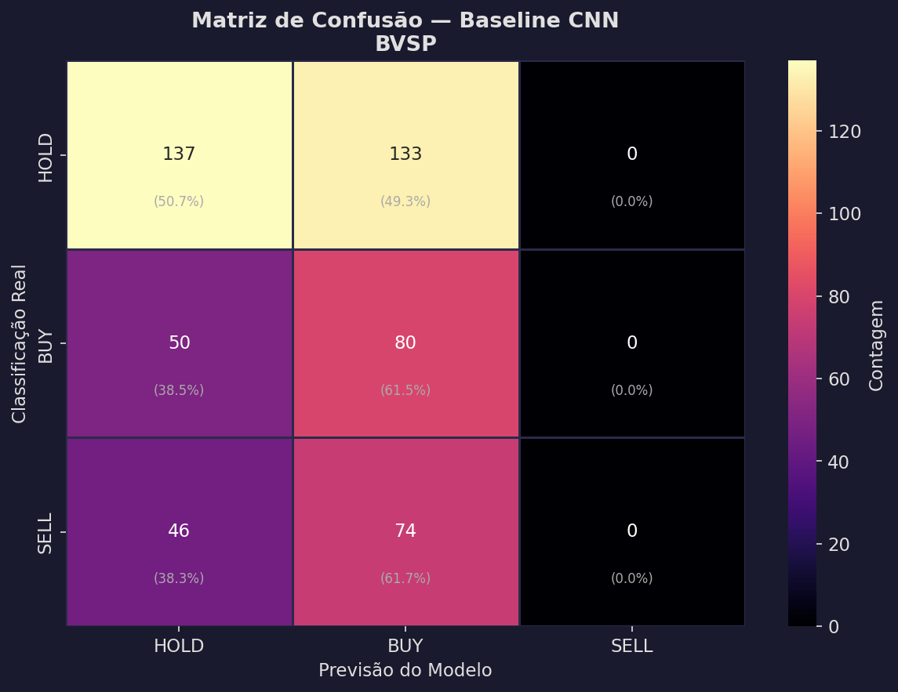

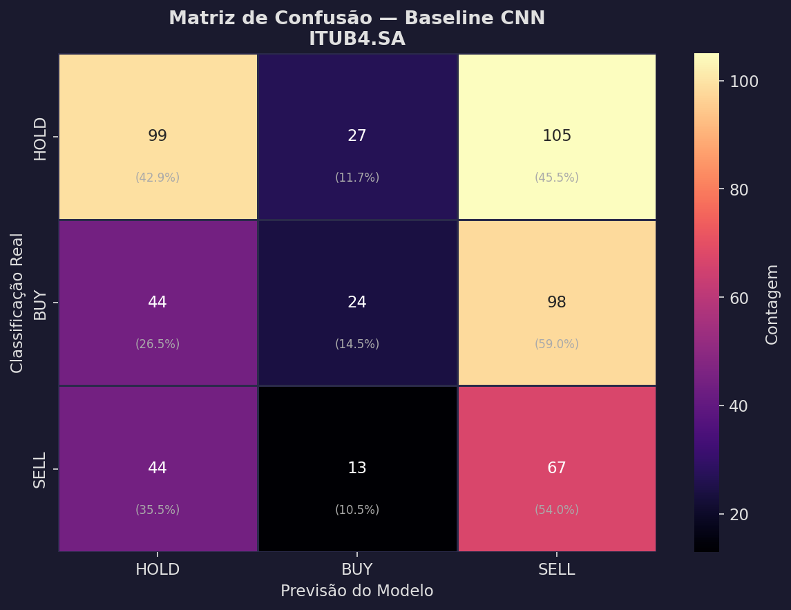

### MSR-CNN Clássico

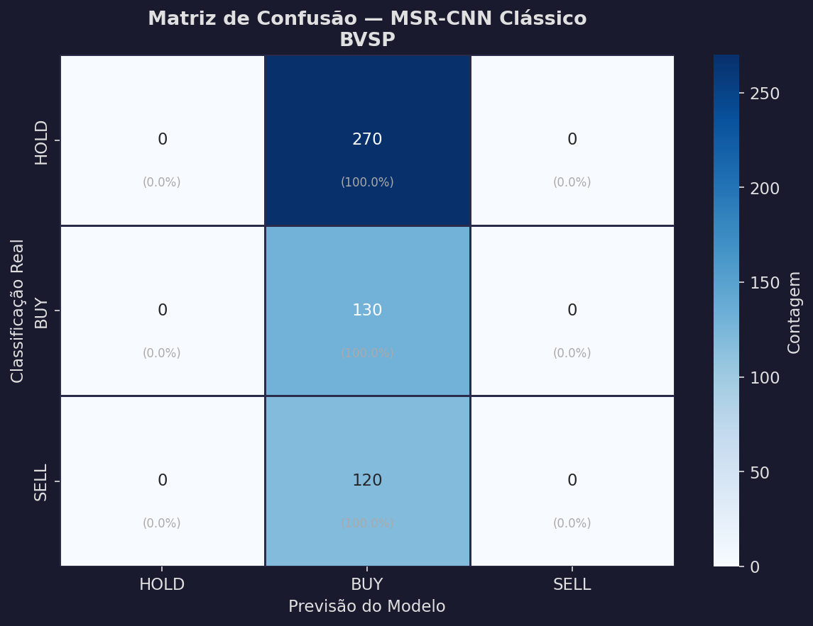

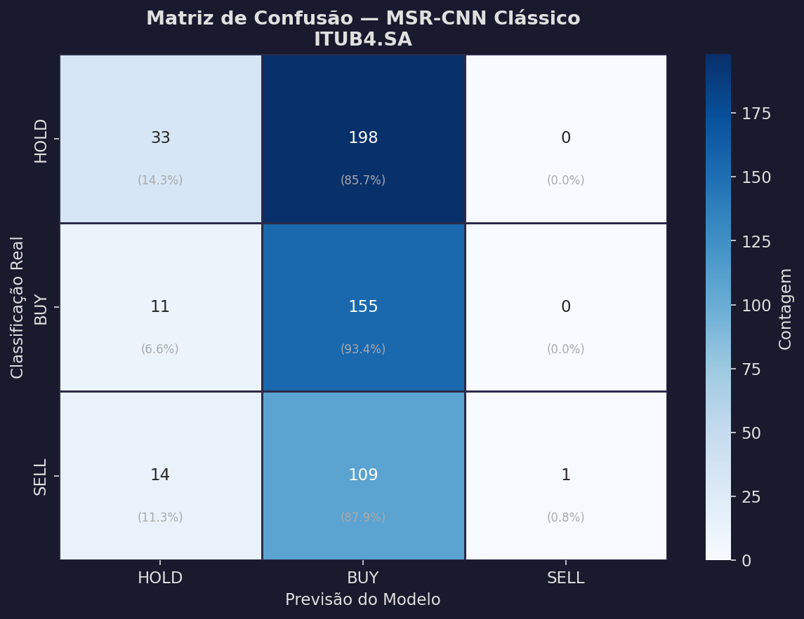

### MSR-CNN Attention

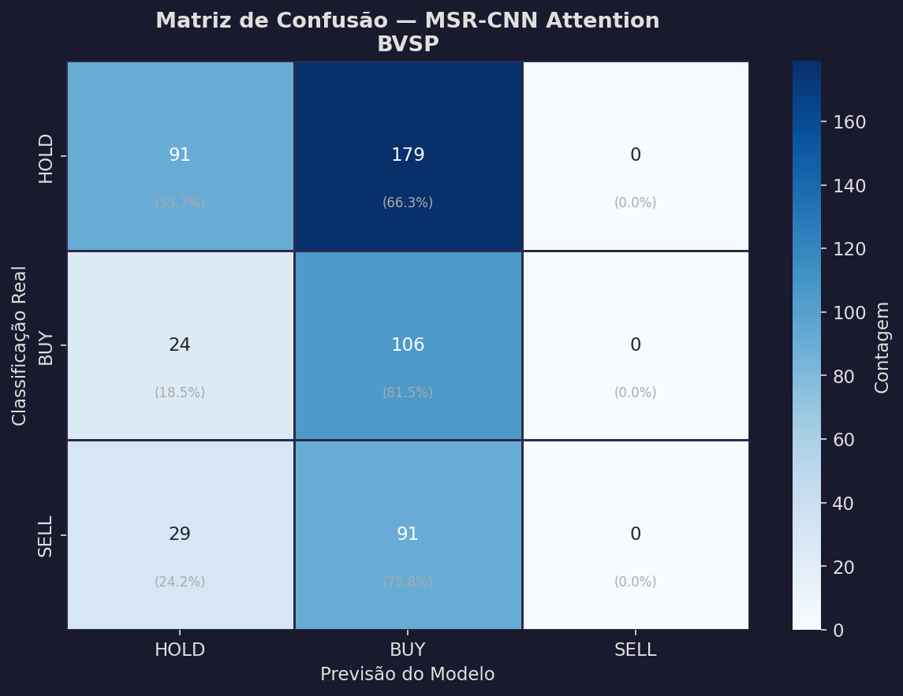

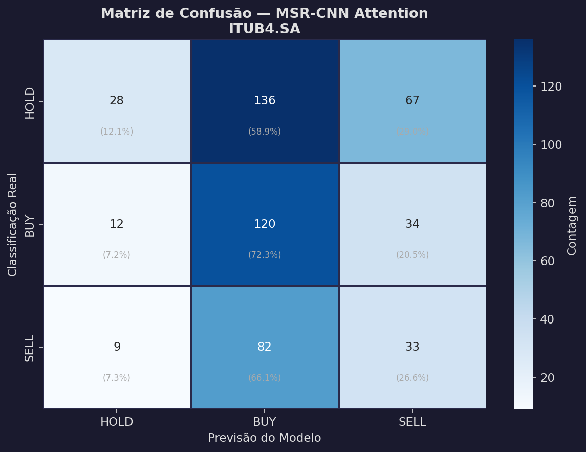

### Como interpretar as Matrizes de Confusão:

- **Eixo Y (vertical):** Classe real (o que de fato aconteceu no mercado).
- **Eixo X (horizontal):** Classe prevista pelo modelo.
- **Diagonal principal (canto superior-esquerdo → canto inferior-direito):** Contém os **acertos**. Quanto maiores os números na diagonal, melhor o modelo.
- **Fora da diagonal:** São os **erros**. Cada célula indica quantas vezes o modelo confundiu uma classe com outra.
- **Percentuais entre parênteses:** Proporção em relação ao total daquela classe real (linha). Ex: "(81.5%)" significa que 81.5% das amostras reais de BUY foram corretamente previstas como BUY.

**Padrão observado:** Todos os modelos apresentam dificuldade significativa em prever a classe SELL, com altas taxas de confusão entre SELL e BUY/HOLD. Isso é um fenômeno amplamente documentado na literatura de finanças quantitativas, causado pela assimetria natural entre movimentos de alta e queda nos mercados emergentes.

---

## 7. Discussão dos Resultados

### 7.1 Desempenho Geral

Os resultados mostram que a previsão direcional de ativos financeiros é um problema intrinsecamente difícil. Acurácias entre 31% e 44% podem parecer modestas à primeira vista, mas devem ser contextualizadas:

1. **Baseline aleatório:** Um classificador aleatório para 3 classes teria ~33% de acurácia. Modelos que consistentemente superam esse patamar demonstram capacidade de captura de padrões reais.
2. **Eficiência de Mercado:** A Hipótese dos Mercados Eficientes (Fama, 1970) postula que preços já refletem toda a informação disponível, tornando previsões consistentemente superiores ao acaso estatisticamente improváveis a longo prazo.
3. **Não-Estacionariedade:** O mercado brasileiro passou por eventos extremos no período de teste (eleições, mudanças de política monetária, crises internacionais), causando quebras de regime que invalidam padrões aprendidos em períodos anteriores.

### 7.2 O Verdadeiro Diferencial: Interpretabilidade

O valor central deste trabalho não reside exclusivamente na acurácia preditiva, mas na **interpretabilidade estrutural** que a arquitetura MSR-CNN proporciona:

- **Os gráficos FFT provam** que a rede aprendeu, sem supervisão, a criar filtros espectrais coerentes com a teoria econômica.
- **Os pesos de atenção revelam** como a rede pondera diferentes horizontes temporais dependendo do regime de mercado.
- **A decomposição em subbandas permite** que analistas entendam *por que* o modelo tomou uma decisão, não apenas *qual* decisão tomou.

### 7.3 Dificuldade com a Classe SELL

Todos os três modelos apresentam recall muito baixo para SELL. Isso ocorre porque:

1. **Assimetria do mercado:** Historicamente, mercados acionários tendem a subir ao longo do tempo (viés de alta), fazendo com que sinais de venda sejam mais raros e menos padronizados.
2. **Velocidade das quedas:** Movimentos de queda são tipicamente mais rápidos e violentos que movimentos de alta, dificultando a captura por modelos que utilizam janelas fixas de 32 dias.
3. **Desbalanceamento de classes:** A proporção natural de amostras SELL é frequentemente menor que BUY e HOLD, reduzindo o material de aprendizado disponível.

### 7.4 Limitações e Trabalhos Futuros

- **Dados exógenos:** A inclusão de variáveis macroeconômicas (taxa SELIC, câmbio, VIX) poderia melhorar a captura de regimes.
- **Ensemble com recalibração:** Combinar os 3 modelos via stacking ou voting poderia mitigar fraquezas individuais.
- **Retreinamento periódico (Walk-Forward):** Um esquema de janela deslizante de retreinamento poderia adaptar o modelo a mudanças de regime.

---

## 8. Arquivos Gerados

### Interpretabilidade Espectral (`results/`)
| Arquivo | Descrição |
|---|---|
| `fft_filters_*.png` | Resposta em frequência dos filtros ASD aprendidos |
| `attention_weights_*.png` | Pesos médios de atenção por classe predita |

### Validação Temporal (`results/validation/`)
| Arquivo | Descrição |
|---|---|
| `temporal_msr-cnn_attention_*.png` | Previsões sobrepostas ao preço real |
| `confusion_*_*.png` | Matrizes de confusão por modelo e ativo |
| `detalhado_*_*.csv` | CSV com cada previsão individual (data, preço, retorno real, previsão, probabilidades) |
| `tabela_comparativa.csv` | Resumo de acurácia e F1 de todos os modelos |
